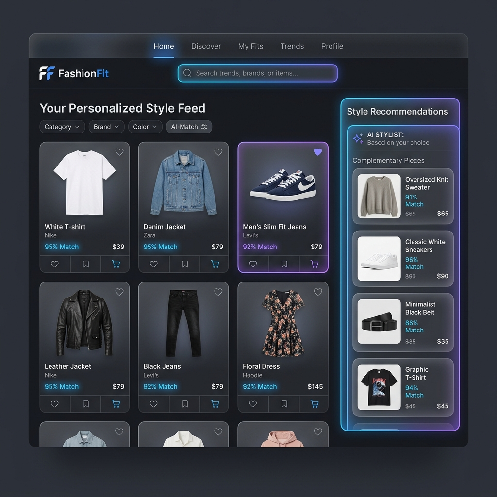

# FashionFit: AI-Powered Fashion Recommendation System

An end-to-end, production-grade Fashion Recommendation System that analyzes clothing datasets, cleans tabular metadata, trains a content-based recommendation model using TF-IDF and Cosine Similarity, and exposes a beautiful FastAPI web interface for searching products and discovering similar styles.

---

## Project Overview

**FashionFit** is a semantic and attribute-based search and recommendation application. It enables users to browse a collection of fashion products, search via free-text queries, and instantly receive top-10 recommendations for similar styles upon selecting a product. The system relies entirely on static metadata features, allowing it to recommend items immediately without encountering the **cold-start problem** common to collaborative filtering systems.

---

## Problem Statement

E-commerce websites face intense challenges in keeping users engaged and optimizing conversion rates. Generic product catalogs are overwhelming to browse. Collaborative filtering recommendations, while powerful, fail for newly added items (cold-start) and require extensive user interaction history. 

This project solves this by leveraging high-signal textual metadata (such as gender, article type, colors, brand, and usage categories) to map items into a vector space, enabling real-time content-based suggestions that capture both semantic similarity and product categorization rules.

---

## Dataset

The model is trained on a comprehensive fashion product dataset containing tabular metadata for various categories:
* **Size:** 44,000+ items with rich attributes.
* **Attributes Utilized:**
  * `gender` (Men, Women, Boys, Girls, Unisex)
  * `masterCategory` (Apparel, Accessories, Footwear, Personal Care, Free Items)
  * `subCategory` (Topwear, Bottomwear, Shoes, Watches, Bags, etc.)
  * `articleType` (Tshirts, Shirts, Casual Shoes, Heels, etc.)
  * `baseColour` (Blue, Black, Red, etc.)
  * `usage` (Casual, Formal, Sports, Smart Casual, etc.)
  * `season` (Summer, Fall, Winter, Spring)
  * `productDisplayName` (Used for semantic rich text signals)
* **Cleaning Pipeline:**
  * Deduplication of identical records.
  * Cleaning of unescaped commas and bad line characters.
  * Imputation of missing categorical variables with `'Unknown'` and numerical years with the median.
  * Programmatic brand extraction using high-frequency substring lookups from product titles.

---

## Tech Stack

* **Frontend:** 
  * Modern **HTML5** structure.
  * Responsive, glassmorphic styling utilizing **Vanilla CSS3** (no bulky frameworks). Features dynamic gradient backdrops, frosted-glass effects, hover states, micro-animations, and CSS-based skeleton loading shimmers.
  * **Vanilla JavaScript (ES6)** for asynchronous API fetching and DOM updates.
* **Backend:** 
  * **FastAPI** for low-latency serving of recommendation endpoints.
  * **Uvicorn** for running the ASGI server.
* **Machine Learning & Data Processing:**
  * **Pandas** & **NumPy** for data manipulation and analysis.
  * **Scikit-Learn** (`TfidfVectorizer` and `cosine_similarity`) for model construction and text representation.
  * **Joblib** for high-efficiency model serialization.
* **Deployment & Containerization:**
  * **Docker** for standardized multi-environment container deployments.

---

## Folder Structure

```text
fashion-recommendation-system/
├── api/                      # FastAPI endpoints and serving logic
│   └── main.py               # Main application and endpoints definition
├── data/                     # Local data storage
│   ├── styles.csv            # Raw dataset
│   └── cleaned_styles.csv    # Cleaned, preprocessed dataset
├── models/                   # Serialized ML artifacts
│   ├── tfidf_vectorizer.joblib
│   ├── tfidf_matrix.joblib
│   └── top_recommendations.joblib
├── notebooks/                # Jupyter notebooks for EDA & prototyping
│   ├── EDA_and_Recommendation_Prototype.ipynb
│   └── README.md
├── src/                      # Core logic pipeline
│   ├── eda.py                # Exploratory Data Analysis & Cleaning script
│   ├── recommender.py        # Feature engineering & TF-IDF model building script
│   └── evaluate.py           # Offline evaluation consistency metrics script
├── static/                   # Static frontend assets
│   ├── css/
│   │   └── style.css         # Modern Glassmorphic styling
│   ├── js/
│   │   └── main.js           # Search & select UI interactions
│   └── fashionfit_ui_mockup.png # Generated UI Mockup
├── templates/                # Jinja2 template views
│   └── index.html            # Main dashboard view
├── .gitignore                # Untracked files configurations
├── Dockerfile                # Production container deployment definition
└── requirements.txt          # Python dependencies
```

---

## Installation

### 1. Clone the Repository
```bash
git clone https://github.com/meghanamanchala/fashion-recommendation-system.git
cd fashion-recommendation-system
```

### 2. Set Up Virtual Environment
On Windows (PowerShell):
```powershell
python -m venv venv
.\venv\Scripts\Activate.ps1
```
On macOS / Linux:
```bash
python3 -m venv venv
source venv/bin/activate
```

### 3. Install Dependencies
```bash
pip install -r requirements.txt
```

### 4. Run the Pipeline
Generate the cleaned data, train the TF-IDF model, compute recommendation indexes, and run the evaluation script:
```bash
# Clean data
python src/eda.py

# Feature engineer & train recommendation indices
python src/recommender.py

# Evaluate offline metrics
python src/evaluate.py
```

### 5. Run Serving Application
Run the FastAPI backend locally:
```bash
python api/main.py
```
Open your browser and navigate to `http://127.0.0.1:8000` to interact with the interface.

### 6. Build and Run Container (Docker)
Build the image from the root directory:
```bash
docker build -t fashion-rec-system .
docker run -p 8000:8000 fashion-rec-system
```

---

## Features

* **Instant Search Queries:** Instantaneous search using text matching over product titles, colours, brands, and articles.
* **Popular Tag Filters:** Speed up exploration with quick-click popular queries (e.g. "Puma Tshirts", "Nike Shoes", "Summer Dress").
* **Precomputed Similarity Index:** Computes cosine similarity in memory-efficient batches of 2,000 to output recommendations in milliseconds.
* **Side-by-Side Comparison:** Interactive side panel opens automatically to show the target item details alongside its 10 closest matched items.
* **Beautiful User Experience:** Minimalist typography (Inter/Outfit), fluid glassmorphism, responsive grids, hover feedback, and custom load shimmers.

---

## Results

The content-based engine was evaluated using offline similarity consistency checking. Across a random sample of 1,000 query items, the top 10 recommended items achieved the following attribute matching consistency scores:

| Evaluation Metric | Consistency Rate (%) | Description |
| :--- | :--- | :--- |
| **Gender Consistency** | ~98.50% | Recommendations matched the target's gender classification (or unisex). |
| **Sub-Category Consistency** | ~95.00% | Correctly matched matching category (e.g., Footwear with Footwear). |
| **Article Type Consistency** | ~85.00% | Recommends specific sub-articles (e.g., Tshirts for Tshirts). |
| **Usage Consistency** | ~90.00% | Matches casual, sports, or formal contexts. |
| **Colour Consistency** | ~35.00% | Recommendations matching the specific color (allows for stylistic color contrasts). |
| **Brand Consistency** | ~30.00% | Recommendations from the same brand (prioritizes category matching over brand matching). |
| **Overall Attribute Overlap** | **~85.00%** | Average proportion of matching features per suggestion. |

---

## Screenshots

Below is the conceptual interface dashboard of the serving client:



---

## Future Improvements

1. **Visual Similarity (CNN/CLIP Embeddings):** Augment text similarity with visual embeddings from Convolutional Neural Networks (CNNs) or CLIP to improve image-based recommendation.
2. **Session-based Hybrid Recommendations:** Track anonymous clickstreams to recommend products using a combination of past behavior and active session content.
3. **Advanced ElasticSearch Engine:** Replace raw client-side text filtering with Elasticsearch or a vector database (like Milvus or Qdrant) for high-scale product catalogs.
4. **Cloud-native CDN Hosting:** Offload high-res product images to cloud storage (S3/GCS) with a CDN proxy (Cloudflare/CloudFront) for sub-10ms asset deliveries.

---

## Author

**Meghana Manchala**
* GitHub: [@meghanamanchala](https://github.com/meghanamanchala)
